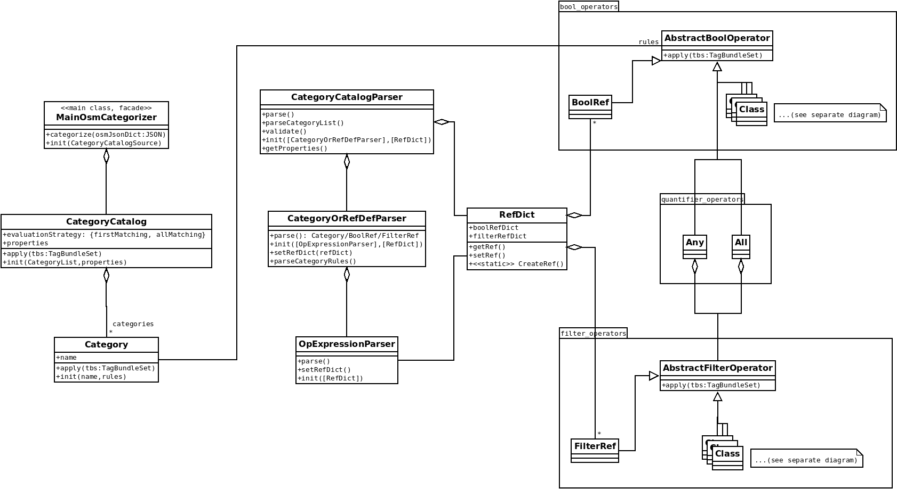
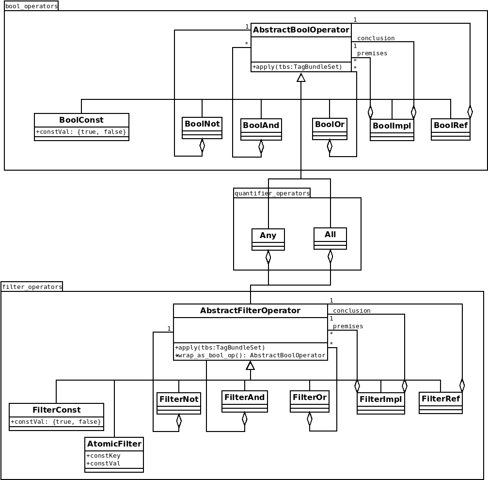
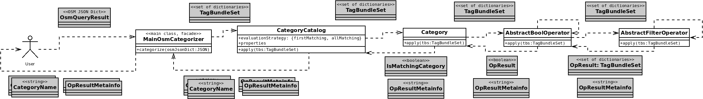
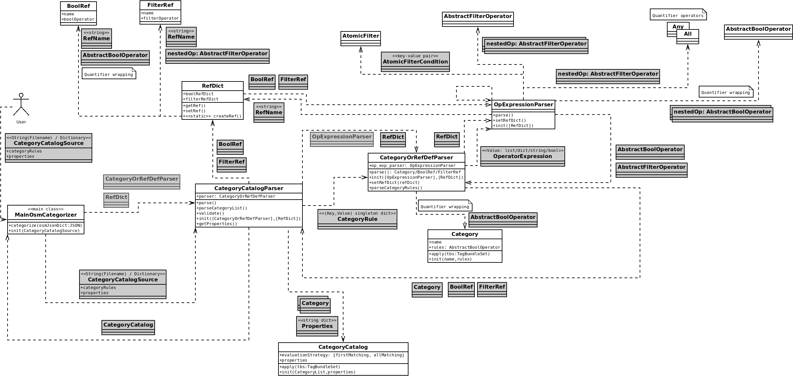

# OpenLostCat Developers' Documentation

## General Structure

The main class diagram is as follows. See details about its parts in the subsequent sections. The main entry point for users is the _MainOsmCategorizer_ class, as written in the user documentation.

## Data Representation

The input data of a rule collection is basically in JSON, either read from a file or as content directly passed to the initializer of _MainOsmCategorizer_. It is parsed into a _CategoryCatalog_ which then becomes able to assign category labels to so-called _tag bundle sets_, an immutable set of dictionaries representing the tag data of each queried OpenStreetMap object in the proximity of a coordinate point. This way, a _tag bundle set_ is the source data taken for categorizing a single location (although the exact coordinates are not passed to CategoryCatalog). 

A _tag bundle_ is the tag data in the form of a python dictionary of a single OpenStreetMap object being looked at for its contribution in the categorization. Its key-value pairs are the exact OpenStreetMap tag name-value pairs as atomic values.

Category names to be returned are simply strings.

## Classes

### Overview of CategoryCatalog and Category classes

A _CategoryCatalog_ is the internal and functional representation of the rule collection read and parsed from JSON. It contains the properties for the evaluation strategy and the categories defined.

A _Category_ object can determine by _apply()_ if a tag bundle set matches, that is, meets the rule conditions defined for the category or not, and the _CategoryCatalog_ returns the category names as label(s) for which the tag bundle set is a match.

Instances of subclasses of abstract operator classes build up the OO-representation of an expression. Actually, an operator object represents a subexpression in the expression tree whose root is the operator in question. Non-atomic operators contain their operands recursively, and an _apply()_ call descends in the expression tree accordingly. See more about operators below.

### Parsers and RefDict

_CategoryCatalogParser_ is responsible for the whole parsing process. It contains and invokes a _CategoryOrRefDefParser_ for each named definition in the rule collection and returns either a _Category_ or a reference definition (_FilterRef_ or _BoolRef_) corresponding to the format of the name being defined (whether it starts with _#_or _##_ or none of these).

_RefDict_ is the dictionary of named subexpressions (the so-called _references_) in two levels as described below. It is not used after parsing, as the reference objects are created and added to the expression tree during parsing. If a reference is used more than once, the same object (expression subtree) will be referenced, so it is not duplicated. For category/bool-level references the boolean result is cached for repetitive applications for the same input. An external _RefDict_ can be passed to the parsers in case of any defaults (might come as future development), but the default is creating an empty RefDict at the beginning of the parsing process.

_OpExpressionParser_ is called recursively for each JSON element or structural construct in the input being observed as an operator, and it creates the operator object of the appropriate type as described by the language syntax.

### Rule Language and Operator Hierarchies

See the general description of the rule language with features in the user documentation.

The class diagram of operators is as follows:

The language has two clearly and formally identifiable levels: 
* _Set-level_ (or _Filter-level_) operators work as filters on subsets of the input tag bundle set, outputting the tag bundles match the conditions represented by the operators (subexpressions), 
* _Category-level_ (or _Bool-level_) operators evaluate and produce single boolean values based on quantified results of the filters. 

Syntactically the same logical operator (such as _AND_) can be on either level but the actual operator object being created by parsing becomes different based on its actual level in the expression (either _FilterAnd_ or _BoolAnd_). The choice is derived from the structure of the expression and the actual position of the operator, based on either the use of explicit quantifiers or implicit quantifier wrapping as described below.

The level of the actual operator is determined inside-out, starting from the leaves of the expression tree. An atomic condition (atomic filter, or filter const) is on the filter level, and their logical operations work on this level as well, as long as there is no quantification.

_Quantifier_ operators bridge between set(filter)-level subexpressions and category(bool)-level subexpressions
by quantifying the filtered result set into a single bool value:
* Universal quantifier (_ALL_)- returns True if the filter subexpression equals to its given operand (all tag bundles match in the input set)
* Existential quantifier (_ANY_) - returns True if the filter subexpression is nonempty (some of the tag bundles match in the input set)

Logical operators over quantified subexpressions are of bool-level operators as they get and produce single boolean values.

Level of references are determined by their type, where a single # prefix refers to a filter-level reference (subexpression) and a double ## prefix refers to a bool-level reference (subexpression).

The top-level expression of a _Category_ must always be a category(/bool)-level expression, that is, quantified.

### Quantifier Wrapping 

The above general scheme applies wherever an explicit quantification is used and the structure of the expression is clear in terms of no operator having operands of different levels. 
To make the syntax simpler for usual, common-sense cases, quantifiers are generated implicitly wherever they are needed, based on the quantifier wrapping rules described in the user documentation.

### Operator Simplification

A further implicit processing aspect is wherever an unary AND or OR operator is read from the input, it is not constructed as such, but left out and directly substituted by its operand. 

The reason why such cases happen is that any key-value pair must be enclosed in a dictionary (object) in JSON and that translates by default to an AND operator in our language, even if it has only one key-value pair inside. And most of the operators can only be expressed with an explicit JSON key-value pair and they must be enclosed in curly brackets.

### Adding New Operators

Implementing any new operator is straightforward by creating a new operator class under the appropriate abstract operator class (filter or bool level, or both).

A natural extension of the language for a higher variety of atomic conditions (tag value comparison with a constant, regex matching etc.) is possible in the future, but not yet implemented.

For quantifiers, an exact number or ratio of matching items related to the number of total input items, or a range of matching items is a meaningful extension to the current features. Their implementation, however, can be somewhat tricky as we use set semantics and not multisets (the tag bundle set and its filtered intermediate representation must be extended with a count, and it should be managed effectively during filtering and quantification).

## Information Flow

Dynamics of the OpenLostCat processes are represented using specific _information flow diagrams_ below. We have chosen an unusual, but comprehensive form, where classes look similar to what the class diagrams show. 

White class items denote actors in a chain (initiated by the user figure) and invoke, create or pass objects to other actors via the dashed arrows.

Grey classes are the passive objects passed as information during the actions represented by dashed arrows. Some classes have both (active or passive) roles at different points of processing.

Grey-framed grey classes denote optional objects to be passed, and are not passed explicitly by default.

Some extra textual notes are added in the usual UML style.

### Categorization Process

Notes:
* A _CategoryCatalog_ usually has multiple categories and their processing usually involves invocations of multiple _Category_ objects.
* _AbstractBoolOperator_ and _AbstractFilterOperator_ stand for different operator subclasses according to the structure of the actual expression (category rule). The reflexive arrows indicate a possible recursion according to the expression structure, which is not an actual recursion for a particular expression construct, but a descent along the expression tree with different actual operator objects. Bool-level operators may contain other bool-level operators as operands (subtrees) or filter-level operators (in the case of quantifiers). Filter-level operators cannot contain bool-level operators.  

### Parsing Process

Notes:
* _MainOsmCategorizer_ creates the _CategoryCatalogParser_, and it creates and returns the _CategoryCatalog_ object, populated by _CategoryOrRefDefParser_ with _Category_ objects. 
* _CategoryCatalogParser_ creates the _RefDict_ by default, and controls it (adds new references parsed by _CategoryOrRefDefParser_). RefDict is not stored in CategoryOrRefDefParser, only passed to its _OpExpressionParser_, which uses to retrieve reference operator objects by their names.
* _RefDict_ has a static (class-level) factory method _crateRef()_ for creating reference definitions ready to be inserted into a _RefDict_ instance. The factory method is called by CategoryOrRefDefParser (not shown on the diagram).
* _OpExpressionParser_ calls itself recursively as it processes the input expression subtrees, and its recursion terminates at each leaf node (atomic operator such as bool/filter constants or atomic filters).
* Quantifier wrapping is done at the indicated positions.
* _RefDict_ is initialized as empty by default, but an external _RefDict_ can be passed as well to the parsers with pre-populated defaults (not currently utilized). 
* Similar is true for parsers, as different parser implementations may be added in the future, depending on possible other source formats (such as XML, for instance).

## Future Developments

Further types of operations may be introduced or optimizations for processing large amounts of location data (tag bundle sets) such as caching or subexpression rewriting are the obvious future directions for development, as well as adding utilities or further example scenarios and rule collections.

The authors welcome interested contributors and user suggestions for future features.

